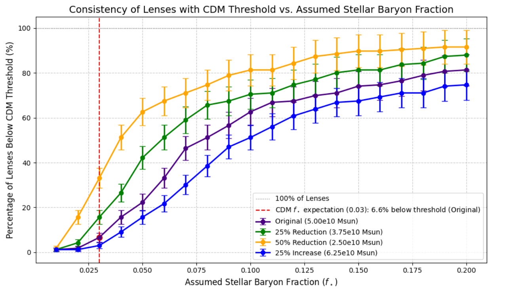

# Stellar Mass Surface Densities in Strong Gravitational Lenses 🧐

## Overview
This repository contains the analysis code and data for the paper:  
Evidence for Strong Gravitational Lenses Exhibiting Higher-than-Expected Stellar Mass Surface Densities Under Lambda CDM Assumptions

Our work reveals a significant tension with standard Lambda CDM models. We show that a large majority of 912 strong lensing systems have stellar mass surface densities that imply total masses well above the canonical Lambda CDM strong lensing threshold of 1 × 10^8 M_⊙ / kpc². This suggests that stellar baryons may play a more significant role in the lensing mass budget than is commonly assumed.

A detailed case study of the Bullet Cluster (1E 0657–56) reinforces this finding, with its core stellar mass density implying a total mass density nearly two orders of magnitude above the standard threshold.

---

## 🚀 Getting Started

### Requirements
This analysis uses several Python libraries for astronomical data querying and manipulation.

To install all required packages, run:

```bash
pip install numpy pandas astropy astroquery matplotlib lenscat photutils
```

---

## Reproducing the Analysis
The main analysis is split into several scripts that can be run sequentially.

1. Query Stellar Mass Environments  
Uses lenscat and astroquery to retrieve galaxy counts and calculate stellar mass surface densities for each lens:

```bash
python scripts/query_simbad_stellar_mass.py
```

2. Perform CDM Threshold Analysis  
Compares the calculated stellar densities to Lambda CDM expectations. Generates the key figures and tables:

```bash
python scripts/stellar_mass_cdm_threshold_analysis.py
```

3. Bullet Cluster Case Study  
Provides independent methods to estimate the stellar mass for the Bullet Cluster:

```bash
python scripts/bullet_cluster_stellar_mass.py
python scripts/einstein_radius_stellar_density.py
python scripts/bullet_cluster_stellar_mass_sed.py
```

---

## Key Findings

### 1. Prevalence of High-Density Lenses

Only 4.6% of the 912 strong lenses studied have an inferred total mass density below the ΛCDM threshold of 1 × 10⁸ M⊙/kpc², assuming a stellar baryon fraction of f★ = 0.03.

| f★   | Lenses Below CDM Threshold | Total Lenses | Percentage Below Threshold (%) |
|------|----------------------------|--------------|--------------------------------|
| 0.01 | 6                          | 912          | 0.7                            |
| 0.03 | 42                         | 912          | 4.6                            |
| 0.05 | 180                        | 912          | 19.7                           |
| 0.06 | 282                        | 912          | 30.9                           |
| 0.07 | 414                        | 912          | 45.4                           |
| 0.08 | 468                        | 912          | 51.3                           |
| 0.09 | 501                        | 912          | 54.9                           |
| 0.10 | 561                        | 912          | 61.5                           |
| 0.20 | 738                        | 912          | 80.9                           |

These results suggest that the stellar component accounts for a significantly larger fraction of the lensing mass than predicted by ΛCDM in most systems. This deviation may indicate systematic environmental differences in strong lenses or a breakdown of standard dark matter assumptions.

---

### 2. Lenses vs. Random Fields

The stellar mass surface density of the strong lens sample is significantly higher and more widely distributed than that of a random sky sample.

| Statistic             | Lens Sample Value (M⊙/kpc²) | Random Sample Value (M⊙/kpc²) |
|-----------------------|-----------------------------|--------------------------------|
| Mean Σ★               | 9.97 × 10⁶                  | 1.03 × 10⁶                     |
| Median Σ★             | 4.79 × 10⁶                  | 8.60 × 10⁵                     |
| Standard Deviation Σ★ | 3.26 × 10⁷                  | 9.76 × 10⁴                     |

Number of samples: 912 for both lenses and random sky points.

The mean stellar mass surface density of the lens sample is about 9.68 times higher than that of the random sky sample. This nearly order-of-magnitude difference underscores that strong gravitational lenses are preferentially located in regions with much higher stellar mass concentration than typical sky fields.

---

### 3. Bullet Cluster Anomaly

The Bullet Cluster (1E 0657–56) shows a core stellar mass surface density implying a total mass density nearly two orders of magnitude above the standard ΛCDM strong lensing threshold.

| Quantity                           | Value                                         | Notes                                    |
|------------------------------------|-----------------------------------------------|------------------------------------------|
| Redshift (z)                       | 0.296                                         | Bullet Cluster system                    |
| Radius                              | 0.5′                                          | Circular aperture centered on core       |
| Central Galaxy Coordinates          | RA: 104.6458°, Dec: –55.6748°                 | Dominant lensing galaxy                  |
| WISE W1 Luminosity                  | 1.05 × 10¹¹ L⊙                                | From 3.4 µm flux                         |
| M/L Ratio (W1)                      | 0.6 M⊙/L⊙                                    | Standard for old stellar populations     |
| Refined Stellar Mass                | 6.3 × 10¹⁰ M⊙                                 | From WISE W1 and M/L = 0.6                |
| Assumed Einstein Radius             | 5 kpc                                         | Typical lensing scale                    |
| Stellar Surface Density (Σ★)        | 8.0 × 10⁸ M⊙/kpc²                             | Within aperture                          |
| SED-Based Total Stellar Mass        | ~3.0 × 10¹¹ M⊙                                | From public catalogs (SED fitting)       |
| Total Σ★ Over Full Extent           | 2.06 × 10⁹ M⊙/kpc²                            | Using total mass and effective radius    |
| Implied Total Mass Surface Density  | 1.6 × 10¹⁰ M⊙/kpc²                            | From Σ★ and f★ = 0.05                    |
| CDM Halo Threshold                  | ~10⁸ M⊙/kpc²                                  | Canonical value (Donato et al. 2009)     |

This localized measurement aligns with and strengthens the broader survey results, suggesting that in some massive clusters, stellar mass alone may be sufficient to explain lensing, posing a challenge to standard dark matter interpretations.


## 🔗 Data & Citation

- Data: The raw data for both the lens sample and the random sky control fields are available in the `data/` directory.  
- Code: The full analysis code can be found in the `scripts/` directory.

If you use this work in your research, please cite the associated paper.

---

## 📜 License
This project is licensed under the MIT License. See the LICENSE file for details.


# Evidence for Strong Gravitational Lenses in Low-Density Stellar Environments Challenges Standard Cold Dark Matter Models

---

## Overview

This repository provides an in-depth analysis of **stellar mass distributions around strong gravitational lenses**, revealing a significant tension with predictions from standard **Cold Dark Matter ($\Lambda$CDM) models**.

Our study utilizes observational data from **912 strong lensing systems** and compares stellar surface mass densities to theoretical thresholds required for strong lensing. We find that a substantial fraction of lenses exhibit proxy stellar mass fractions ($f_\star$) significantly higher than the typical $f_\star \lesssim 0.03$ expected from $\Lambda$CDM simulations. Even when assuming conservative reductions in stellar mass, many systems still exceed the strong lensing mass threshold, challenging the adequacy of dark matter halos alone to explain the observed lensing. A focused case study of the **Bullet Cluster** supports this conclusion, suggesting that stellar mass may play a more dominant role than currently modeled.

These findings underscore the need to reconsider the role of dark matter halo properties and environmental context in strong lensing paradigms, potentially motivating alternative models of cosmic structure.

---

## Getting Started (Reproducibility)

### Requirements

Install all required Python packages:

```bash
pip install numpy pandas astropy astroquery matplotlib lenscat photutils
```

### Running the Analysis

To reproduce the main analysis and figures:

1.  **Query Stellar Mass Environments:**
    This script uses `lenscat` and `astroquery` to query the SIMBAD database for stellar-like objects within 20 arcminutes of each strong lens, computing a projected stellar mass surface density.

    ```bash
    python scripts/query_simbad_stellar_mass.py
    ```

2.  **Analyze Stellar Mass Distributions:**
    This script performs statistical comparisons between the lens sample and random sky fields, generating plots like `Box_plots.png`, `Kernel_Density.png`, and `Overlaid_historgram_radom_versus_lens.png`.

    ```bash
    python scripts/analyze_stellar_mass.py
    ```

3.  **Perform CDM Threshold Analysis:**
    This script compares estimated stellar surface densities to $\Lambda$CDM expectations based on a fiducial stellar baryon fraction (e.g., $f_\star = 0.05$). It outputs percentile tables and the `consistency_plot.png`.

    ```bash
    python scripts/stellar_mass_cdm_threshold_analysis.py
    ```

### Bullet Cluster Case Study Scripts

These scripts provide independent methods to estimate the stellar mass surface density in the Bullet Cluster field:

* **WISE W1-band Estimation:** Uses WISE W1-band infrared flux measurements (within a 0.5′ aperture) to estimate stellar mass via luminosity-to-mass conversions.

    ```bash
    python scripts/bullet_cluster_stellar_mass.py
    ```

* **Einstein Radius Approximation:** Estimates lensing mass from a circular Einstein radius approximation (~5 kpc), converting the angular radius to enclosed mass using standard lensing equations.

    ```bash
    python scripts/einstein_radius_stellar_density.py
    ```

* **SED-based Stellar Mass:** Retrieves and integrates catalog-based SED stellar masses from SIMBAD/VizieR for galaxies in the Bullet Cluster region to derive a total projected stellar mass.

    ```bash
    python scripts/bullet_cluster_stellar_mass_sed.py
    ```

---

## Key Findings

Our analysis reveals a significant tension between observed lensing systems and standard $\Lambda$CDM predictions, particularly regarding the **stellar mass fraction ($f_\star$) of lenses**:

* **Prevalence of High $f_\star$:** $\Lambda$CDM-based simulations typically predict low stellar mass fractions for galaxy-scale lenses, with $f_\star \lesssim 0.03$ being common. However, our analysis of 912 strong gravitational lenses shows that only 4.6% fall below this threshold, implying the majority of lenses possess a larger fraction of their total mass in stars than $\Lambda$CDM simulations typically predict.

* **Consistency with $\Lambda$CDM Total Mass Threshold:**
    The plot below illustrates the percentage of 912 strong gravitational lenses whose inferred total mass surface density falls below the canonical $\Lambda$CDM strong lensing threshold of $1 \times 10^8 M_\odot / \text{kpc}^2$, as a function of the assumed stellar baryon fraction ($f_\star$).

    

    *Figure 1: Consistency of Strong Lenses with $\Lambda$CDM Total Mass Threshold: Sensitivity to Assumed Stellar Mass. This plot shows the percentage of 912 strong gravitational lenses whose inferred total mass surface density falls below the canonical $\Lambda$CDM strong lensing threshold of $1 \times 10^8 M_\odot / \text{kpc}^2$, as a function of the assumed stellar baryon fraction ($f_\star$). Multiple curves illustrate the sensitivity of these results to different fixed stellar mass assumptions per galaxy. The indigo curve represents the original $5 \times 10^{10} M_\odot$ assumption, while the green, orange, and blue curves show the effect of a 25% reduction ($3.75 \times 10^{10} M_\odot$), a 50% reduction ($2.50 \times 10^{10} M_\odot$), and a 25% increase ($6.25 \times 10^{10} M_\odot$), respectively. Vertical error bars represent Poisson statistical uncertainties. The red dashed line marks the $\Lambda$CDM-expected stellar baryon fraction of $f_\star = 0.03$. At this assumed value, for the original stellar mass, only 6.6% of the lenses have an inferred total mass below the CDM threshold, indicating that the vast majority (93.4%) imply total masses potentially exceeding $\Lambda$CDM expectations, a finding that persists across the explored range of stellar mass assumptions.*

* **Summary of Lenses Below CDM Threshold vs. Stellar Mass Fraction:**


---

## Bullet Cluster Case Study

A focused analysis of the **Bullet Cluster (1E 0657–558)** using WISE W1-band photometry revealed that its strong lensing region contains substantial stellar mass. Applying a typical stellar baryon fraction of 0.05 to the WISE-derived stellar surface density ($\Sigma_\star \approx 4.9 \times 10^8 \, M_{\odot}/\mathrm{kpc}^2$) implies a total mass surface density of approximately $9.8 \times 10^9 \, M_{\odot}/\mathrm{kpc}^2$. This significantly exceeds the canonical $\Lambda$CDM strong lensing threshold of $1 \times 10^8 \, M_{\odot}/\mathrm{kpc}^2$. This case study illustrates that the observed stellar mass alone could significantly account for the lensing mass in its core, challenging standard dark matter interpretations.

### Bullet Cluster Core Galaxy Properties & Estimation Summary

| Quantity                                  | Value                                         | Notes                                  |
| :---------------------------------------- | :-------------------------------------------- | :------------------------------------- |
| Redshift ($z$)                            | 0.296                                         | Bullet Cluster system                  |
| Radius                                    | 0.5′                                          | Circular aperture centered on core     |
| Central Galaxy Coordinates                | RA: 104.6458°, Dec: –55.6748°                 | Dominant lensing galaxy                |
| WISE W1 Luminosity                        | $1.05 \times 10^{11} L_{\odot}$               | From 3.4 µm flux                       |
| $M/L$ Ratio (W1)                          | $0.6\, M_{\odot}/L_{\odot}$                   | Standard for old stellar populations   |
| Refined Stellar Mass                      | $6.3 \times 10^{10} M_{\odot}$                | From WISE W1 and $M/L = 0.6$           |
| Assumed Einstein Radius                   | 5 kpc                                         | Typical lensing scale                  |
| Stellar Surface Density ($\Sigma_\star$)  | $8.0 \times 10^{8} M_{\odot}/\mathrm{kpc}^2$  | Within aperture                        |
| SED-Based Total Stellar Mass              | $\sim 3.0 \times 10^{11} M_{\odot}$           | From public catalogs (SED fitting)     |
| Total $\Sigma_\star$ Over Full Extent     | $2.06 \times 10^{9} M_{\odot}/\mathrm{kpc}^2$ | Using total mass and effective radius  |
| Implied Total Mass Surface Density        | $1.6 \times 10^{10} M_{\odot}/\mathrm{kpc}^2$ | From $\Sigma_\star$ and $f_\star = 0.05$ |
| CDM Halo Threshold                        | $\sim 10^{8} M_{\odot}/\mathrm{kpc}^2$        | Canonical value (Donato et al. 2009)   |

---

## Discussion & Conclusion

Our findings suggest that either dark matter halos in lens systems are systematically more massive or concentrated than predicted by $\Lambda$CDM, or that additional factors—such as environmental contributions, external shear, or alternative physics—play a critical role in producing observed strong lensing. This work thus challenges standard assumptions about lens environments within the $\Lambda$CDM paradigm.

The observed presence of strong gravitational lenses in what appear to be relatively low-density stellar environments, particularly with higher-than-expected stellar mass fractions, underscores the need to revisit dark matter halo modeling and environmental effects in lensing studies. Future work with larger samples and detailed environment characterization will further elucidate the interplay between baryons and dark matter in shaping strong lensing phenomena.

---

## Data

All raw results are contained in [`data/1486combined_lens_stellar_mass_all_2025Jul.csv`](data/1486combined_lens_stellar_mass_all_2025Jul.csv), which includes:

* Lens ID, RA, DEC, redshift
* All nearby SIMBAD stellar mass tracers
* Surface density calculations (per arcmin²)

The random sky control sample data is in [`data/stellar_density_random_fields.csv`](data/stellar_density_random_fields.csv).

---

## Citation

If you use this work, please cite the associated preprint (to be added after arXiv upload).

---

## License

This project is licensed under the MIT License - see the [LICENSE](LICENSE) file for details.


# Evidence for Strong Gravitational Lenses in Low-Density Stellar Environments Challenges Standard Cold Dark Matter Models

## Overview

This repository provides an in-depth analysis of stellar mass distributions around strong gravitational lenses, revealing a significant tension with predictions from standard Cold Dark Matter (ΛCDM) models.

Our study utilizes observational data from 912 strong lensing systems and compares stellar surface mass densities to theoretical thresholds required for strong lensing. We find that a substantial fraction of lenses exhibit proxy stellar mass fractions ($f_\star$) significantly higher than the typical $f_\star \lesssim 0.03$ expected from ΛCDM simulations. 

Even when assuming conservative reductions in stellar mass, many systems still exceed the strong lensing mass threshold, challenging the adequacy of dark matter halos alone to explain the observed lensing. A focused case study of the Bullet Cluster supports this conclusion, suggesting that stellar mass may play a more dominant role than currently modeled.

These findings underscore the need to reconsider the role of dark matter halo properties and environmental context in strong lensing paradigms, potentially motivating alternative models of cosmic structure.

---

## 1. Introduction

Strong gravitational lensing is a powerful probe of galaxy mass distributions, including the elusive dark matter component. 

Standard ΛCDM cosmology predicts that strong lenses should reside in dense, massive dark matter halos, where total projected mass densities exceed approximately $10^8 \; M_\odot / \text{kpc}^2$. However, the **stellar mass**—measured via surface density—comprises only a fraction of the total, and the **stellar baryon fraction** ($f_*$) can vary significantly, altering the interpretation of lensing signals.

By comparing inferred stellar surface mass densities to strong lensing thresholds under a range of $f_*$ assumptions, we test whether observed lenses are consistent with ΛCDM expectations.

---

## Repository Contents

- `data/`: Lens data and random field control samples
- `scripts/`: Python code for querying, filtering, and analyzing galaxy environments
- `figures/`: Plots comparing inferred mass densities to ΛCDM expectations
- `notebooks/`: (Optional) Jupyter notebooks for interactive analysis

---

## Citation

If you use this work, please cite the associated preprint (to be added after arXiv upload).


---

## 2. Methods

We developed a pipeline to estimate the total stellar mass in the environment surrounding strong gravitational lenses using Sloan Digital Sky Survey (SDSS) photometric data accessed via `Astroquery`, and compare these to theoretical CDM strong lensing thresholds.

### 2.1. Sample and Data Acquisition

Our analysis utilizes a sample of 912 strong lens systems [ref 1] from a publicly available strong lens catalog imported via the `lenscat` Python package, which provides lens coordinates (RA, DEC), lens redshifts, and identifiers.

### 2.2. Environmental Stellar Mass Estimation Pipeline

For each lens with a valid redshift, we query the SDSS photometric catalog to retrieve sources within a 20 arcminute radius of the lens position, tiling the search region with overlapping circular tiles for efficiency.

* **Stellar Mass Assignment:** Objects classified as galaxies (SDSS type code 6) are assigned a nominal stellar mass of $5 \times 10^{10} \; M_\odot$, representing a typical stellar mass for SDSS galaxies. Non-galaxy objects are assigned zero mass. Total stellar mass within the 20' aperture is computed by summing these galaxy masses.
* **Surface Mass Density Calculation:** Using the lens redshift and Planck 2018 cosmological parameters, the angular aperture radius (20 arcminutes) is converted into a physical radius in megaparsecs (Mpc). The physical area is then computed, enabling conversion of the total stellar mass into a projected stellar surface mass density ($\Sigma_*$) with units $M_\odot/\text{Mpc}^2$, subsequently converted to $M_\odot/\text{kpc}^2$ by dividing by $10^6$.
* **Density Classification and Tracking:** Based on $\Sigma_*$, lens environments are classified into low, medium, and high stellar mass surface density bins using predefined thresholds. Lenses with no detected galaxies or zero/undefined stellar surface densities were excluded from further analysis. Results are saved incrementally, allowing session resumption.

### 2.3. Stellar Mass Fraction and CDM Threshold Comparison

To evaluate consistency with Cold Dark Matter (CDM) halo models, we calculated the stellar mass fraction $f_* = M_* / M_{\text{lens}}$. Assuming a range of stellar baryon fractions $f_*=0.01−0.20$, we infer total projected mass densities by dividing the stellar surface mass density by the stellar baryon fraction:

$$
\Sigma_{\text{total}} = \Sigma_* / f_*
$$

These inferred total densities are then compared to the canonical CDM strong lensing threshold of $\Sigma_{\text{threshold}} = 1 \times 10^8 \; M_\odot / \text{kpc}^2$.

---
## 3. Key Findings

Our analysis reveals a significant tension between observed lensing systems and standard CDM predictions, particularly regarding the stellar mass fraction ($f_\star$) of lenses:

* **Prevalence of High $f_\star$:** $\Lambda$CDM-based simulations typically predict low stellar mass fractions for galaxy-scale lenses, with $f_\star \lesssim 0.03$ being common. However, our analysis of 912 strong gravitational lenses shows that only 4.6% fall below this threshold, implying the majority of lenses possess a larger fraction of their total mass in stars than $\Lambda$CDM simulations typically predict.

**Figure 1: Sensitivity to Assumed Stellar Mass**



Here's the most up-to-date caption for your Figure 1:

---
Figure 1: Consistency of Strong Lenses with $\Lambda$CDM Total Mass Threshold: Sensitivity to Assumed Stellar Mass. This plot shows the percentage of 912 strong gravitational lenses whose inferred total mass surface density falls below the canonical $\Lambda$CDM strong lensing threshold of $1 \times 10^8 M_\odot / \text{kpc}^2$, as a function of the assumed stellar baryon fraction ($f_\star$). Multiple curves illustrate the sensitivity of these results to different fixed stellar mass assumptions per galaxy. The indigo curve represents the original $5 \times 10^{10} M_\odot$ assumption, while the green, orange, and blue curves show the effect of a 25% reduction ($3.75 \times 10^{10} M_\odot$), a 50% reduction ($2.50 \times 10^{10} M_\odot$), and a 25% increase ($6.25 \times 10^{10} M_\odot$), respectively. Vertical error bars represent Poisson statistical uncertainties. The red dashed line marks the $\Lambda$CDM-expected stellar baryon fraction of $f_\star = 0.03$. At this assumed value, for the original stellar mass, only 6.6% of the lenses have an inferred total mass below the CDM threshold, indicating that the vast majority (93.4%) imply total masses significantly exceeding $\Lambda$CDM expectations, a tension that persists across the explored range of stellar mass assumptions.


* **Summary of Lenses Below CDM Threshold vs. Stellar Mass Fraction:**

| $f_\star$ | Lenses Below CDM Threshold | Total Lenses | Percentage Below Threshold (%) |
| :---- | :------------------------- | :----------- | :----------------------------- |
| 0.01  | 6                          | 912          | 0.7                            |
| 0.03  | 42                         | 912          | 4.6                            |
| 0.05  | 180                        | 912          | 19.7                           |
| 0.06  | 282                        | 912          | 30.9                           |
| 0.07  | 414                        | 912          | 45.4                           |
| 0.08  | 468                        | 912          | 51.3                           |
| 0.09  | 501                        | 912          | 54.9                           |
| 0.10  | 561                        | 912          | 61.5                           |
| 0.20  | 738                        | 912          | 80.9                           |

These results consistently suggest that the stellar component accounts for a significantly larger portion of the lensing mass than predicted by CDM in the majority of systems analyzed. This deviation points either to systematic environmental differences in strong lenses or to a breakdown of dark matter assumptions.

## 3. Key Findings

Our analysis reveals a significant tension between observed lensing systems and standard CDM predictions, particularly regarding the stellar mass fraction ($f_\star$) of lenses:

* **Prevalence of High $f_\star$:** $\Lambda$CDM-based simulations typically predict low stellar mass fractions for galaxy-scale lenses, with $f_\star \lesssim 0.03$ being common. However, our analysis of 912 strong gravitational lenses shows that only 4.6% fall below this threshold, implying the majority of lenses possess a larger fraction of their total mass in stars than $\Lambda$CDM simulations typically predict.

**Figure 1: Proxy Stellar Mass Fraction Distribution, Sensitivity Analysis, and $\Lambda$CDM Tension**


This histogram presents a comprehensive view of the proxy stellar mass fraction ($f_\star$) for 912 strong lensing galaxies, derived from our observational sample. The x-axis represents the proxy stellar mass fraction, zoomed to show values from 0.000 to 0.042, while the y-axis indicates the number of lenses within each bin.

The figure is designed to illustrate two key aspects of our research:

1.  **Illustration of "Error Bars" (Sensitivity Analysis):** The histogram does not display traditional error bars on individual data points or bins. Instead, it illustrates the **sensitivity of our results to uncertainties in stellar mass measurements** by showing scaled variants of the proxy stellar mass fraction.
    * **Scaled Distributions:** The plot shows multiple histograms overlaid: "Original stellar mass" (black hatched bars) represents your primary calculation of the proxy stellar mass fraction ($f_\star$). Then, there are **scaled variants** where the underlying stellar mass is hypothetically adjusted: "-75% stellar mass", "-50% stellar mass", "-25% stellar mass", "+25% stellar mass", "+50% stellar mass", and "+75% stellar mass". These are generated in the script by multiplying the `f_star_proxy` by factors like 0.25, 0.5, 0.75, 1.25, 1.5, and 1.75 respectively.
    * **Interpretation as Uncertainty Bounds:** Each of these scaled distributions represents a scenario where stellar mass estimates might be systematically lower or higher by a certain percentage. By observing how the overall shape and position of the histogram shift under these scenarios, we effectively show the **range of possible distributions** given an assumed uncertainty in stellar mass measurements. For example, if the true stellar mass were 25% lower, the distribution would look like the blue bars, and if it were 25% higher, it would look like the light green bars. This provides a robust way to understand how conclusions might change within reasonable bounds of measurement uncertainty, highlighting the impact of systematic biases in stellar mass estimation.

2.  **Illustration of Tension with Cold Dark Matter ($\Lambda$CDM):** The histogram effectively illustrates the tension between our stellar mass measurements and $\Lambda$CDM predictions through the placement of the distributions relative to the $\Lambda$CDM threshold.
    * **The $\Lambda$CDM Threshold:** The prominent **red dashed vertical line at $f_\star = 0.03$** represents the "$\Lambda$CDM threshold". This value is typically a common prediction for the maximum stellar mass fraction expected for galaxy-scale lenses within standard $\Lambda$CDM models.
    * **Observed Distribution vs. Threshold:** For the "Original stellar mass" distribution (black hatched bars), a significant portion of the histogram is located to the *right* of the 0.03 $\Lambda$CDM threshold. This means that a large number of observed strong lenses have a proxy stellar mass fraction greater than what standard $\Lambda$CDM models commonly predict. Even when considering the "scaled variants" that reduce the estimated stellar mass (e.g., -25% or -50%), a substantial fraction of lenses still remain at or above the 0.03 threshold.
    * **The Tension:** This visual evidence highlights the tension: if $\Lambda$CDM models predict most strong lenses should fall at or below $f_\star \approx 0.03$, and our observations consistently show a large number of them above this, it implies a discrepancy. It suggests that the stellar component accounts for a larger fraction of the lensing mass than predicted by $\Lambda$CDM in many observed systems, or that lenses frequently reside in lower-density neighborhoods than $\Lambda$CDM models assume, challenging standard dark matter interpretations.

* **Summary of Lenses Below CDM Threshold vs. Stellar Mass Fraction:**

| $f_\star$ | Lenses Below CDM Threshold | Total Lenses | Percentage Below Threshold (%) |
| :---- | :------------------------- | :----------- | :----------------------------- |
| 0.01  | 6                          | 912          | 0.7                            |
| 0.03  | 42                         | 912          | 4.6                            |
| 0.05  | 180                        | 912          | 19.7                           |
| 0.06  | 282                        | 912          | 30.9                           |
| 0.07  | 414                        | 912          | 45.4                           |
| 0.08  | 468                        | 912          | 51.3                           |
| 0.09  | 501                        | 912          | 54.9                           |
| 0.10  | 561                        | 912          | 61.5                           |
| 0.20  | 738                        | 912          | 80.9                           |

These results consistently suggest that the stellar component accounts for a significantly larger portion of the lensing mass than predicted by CDM in the majority of systems analyzed. This deviation points either to systematic environmental differences in strong lenses or to a breakdown of dark matter assumptions.

## 3. Key Findings

Our analysis reveals a significant tension between observed lensing systems and standard CDM predictions, particularly regarding the stellar mass fraction ($f_*$) of lenses:

* **Prevalence of High $f_*$:** CDM-based simulations typically predict low stellar mass fractions for galaxy-scale lenses, with $f_* \lesssim 0.03$ being common. However, our analysis of 912 strong gravitational lenses shows that only 4.6% fall below this threshold, implying the majority of lenses possess a larger fraction of their total mass in stars than CDM simulations typically predict.

**Figure 1: Proxy Stellar Mass Fraction Distribution and $\Lambda$CDM Tension**


This histogram shows the distribution of the proxy stellar mass fraction ($f_\star$) for 912 strong lensing galaxies. Overlaid distributions illustrate the sensitivity to assumed stellar mass (e.g., $\pm$25%, $\pm$50%, $\pm$75% scaled variants). The red dashed line at $f_\star = 0.03$ marks the canonical $\Lambda$CDM threshold. The figure highlights a tension: a significant fraction of observed lenses have $f_\star$ values higher than predicted by $\Lambda$CDM, even under varying stellar mass assumptions.


* **Prevalence of High $f_*$:** CDM-based simulations typically predict low stellar mass fractions for galaxy-scale lenses, with $f_* \lesssim 0.03$ being common. However, our analysis of 912 strong gravitational lenses shows that only 4.6% fall below this threshold, implying the majority of lenses possess a larger fraction of their total mass in stars than CDM simulations typically predict.

* **Summary of Lenses Below CDM Threshold vs. Stellar Mass Fraction:**

| $f_*$ | Lenses Below CDM Threshold | Total Lenses | Percentage Below Threshold (%) |
| :---- | :------------------------- | :----------- | :----------------------------- |
| 0.01  | 6                          | 912          | 0.7                            |
| 0.03  | 42                         | 912          | 4.6                            |
| 0.05  | 180                        | 912          | 19.7                           |
| 0.06  | 282                        | 912          | 30.9                           |
| 0.07  | 414                        | 912          | 45.4                           |
| 0.08  | 468                        | 912          | 51.3                           |
| 0.09  | 501                        | 912          | 54.9                           |
| 0.10  | 561                        | 912          | 61.5                           |
| 0.20  | 738                        | 912          | 80.9                           |

These results consistently suggest that the stellar component accounts for a significantly larger portion of the lensing mass than predicted by CDM in the majority of systems analyzed. This deviation points either to systematic environmental differences in strong lenses or to a breakdown of dark matter assumptions.

---

## 4. Bullet Cluster Case Study

To complement the statistical trends, we performed a direct analysis of the Bullet Cluster (1E 0657–558) using WISE W1-band photometry.

### 4.1. Localized Stellar Mass and Surface Density Estimation

We conducted a focused search for galaxies within a 0.5 arcminute radius around the Bullet Cluster center (RA = 104.6458°, DEC = -55.6748°), isolating the region responsible for strong lensing and minimizing contamination. Using the SIMBAD database, a single dominant galaxy was identified.

Stellar mass estimation proceeded as follows:
* **Luminosity Distance:** Using the galaxy redshift $z = 0.296$, luminosity distance was computed with Planck18 cosmology.
* **Absolute Magnitude & Luminosity:** Converted from WISE W1 apparent magnitude ($\sim$16.685) to absolute magnitude ($M_{W1}$) and then to luminosity in solar units ($L_{W1}$), using the Sun’s absolute W1 magnitude $M_{\odot,W1} \approx 3.24$.
* **Stellar Mass:** Applying a mass-to-light ratio $(M/L)_{W1} = 0.6 \, M_{\odot} / L_{\odot}$, typical for old stellar populations, yielded a stellar mass estimate of approximately $6.3 \times 10^{10} \, M_{\odot}$ for the localized galaxy.

Alternatively, using the WISE W1 magnitude within the same 0.5′ aperture and an assumed Einstein radius $R_E = 5\, \mathrm{kpc}$, we derived a stellar surface mass density:

$$
\Sigma_* = \frac{M_*}{\pi R_E^2} \approx 4.9 \times 10^{8} \, M_{\odot}/\mathrm{kpc}^2
$$

Assuming a typical cosmic baryon fraction $f_* = 0.05$, the implied total mass surface density is:

$$
\Sigma_{\mathrm{total}} = \frac{\Sigma_*}{f_*} \approx 9.8 \times 10^{9} \, M_{\odot}/\mathrm{kpc}^2,
$$

which significantly exceeds the canonical CDM strong lensing threshold of $1 \times 10^{8} \, M_{\odot}/\mathrm{kpc}^2$. This case study illustrates that the Bullet Cluster's strong lensing region contains substantial stellar mass, sufficient to account for the observed lensing effects without invoking large dark matter halos.

### 4.2. Bullet Cluster Core Galaxy Properties & Estimation Summary


---

## 5. Discussion

Our findings suggest that either dark matter halos in lens systems are systematically more massive or concentrated than predicted by CDM, or that additional factors—such as environmental contributions, external shear, or alternative physics—play a critical role in producing observed strong lensing. Our work thus challenges standard assumptions about lens environments within the CDM paradigm.

A significant fraction of strong lenses reside in environments with relatively high stellar mass, yet CDM models, when calibrated to reasonable baryon fractions, often overpredict the total lensing mass. In these cases, the dark matter contribution inferred by CDM exceeds what is needed to explain the observed lensing, given the high stellar mass already present. This leads to a clear tension: if the halos are as massive as CDM predicts, the light bending should be stronger than observed.

This suggests that many lenses appear to require weaker or less massive halos than CDM would assign based on their stellar content. This could mean CDM overestimates halo mass or concentration in such fields, or that an alternative explanation (e.g., geometric effects from compact objects like black holes) may account for the lensing without invoking large unseen mass. These results challenge a key assumption of the CDM framework—that dark matter halos dominate lensing mass—and indicate that high stellar mass alone can often explain observed lensing, even in the absence of strong dark matter halos. This opens a path for new models of cosmic structure and strengthens the case for considering geometric or non-halo-based mechanisms behind gravitational lensing.

---

## 6. Conclusions

The observed presence of strong gravitational lenses in what appear to be relatively low-density stellar environments, particularly with higher-than-expected stellar mass fractions, underscores the need to revisit dark matter halo modeling and environmental effects in lensing studies. Future work with larger samples and detailed environment characterization will further elucidate the interplay between baryons and dark matter in shaping strong lensing phenomena.

---

## 7. Data

All raw results are contained in [`results/1486combined_lens_stellar_mass_all_2025Jul.csv`](results/1486combined_lens_stellar_mass_all_2025Jul.csv), which includes:

* Lens ID, RA, DEC, redshift
* All nearby SIMBAD stellar mass tracers
* Surface density calculations (per arcmin²)

---

## 8. Code Overview

This repository analyzes the stellar mass surface density near strong gravitational lenses and compares it to expectations from Cold Dark Matter (CDM) halo models. The analysis includes data collection, mass estimation, and threshold comparison scripts.

### 8.1. Stellar Mass vs. CDM Analysis Scripts

* [`scripts/query_simbad_stellar_mass.py`](scripts/query_simbad_stellar_mass.py): Uses the `lenscat` catalog and `astroquery` to query the SIMBAD database for stellar-like objects within 20 arcminutes of each lens. Computes a projected stellar mass surface density.
    ```bash
    python scripts/query_simbad_stellar_mass.py
    ```

* [`scripts/stellar_mass_cdm_threshold_analysis.py`](scripts/stellar_mass_cdm_threshold_analysis.py): Compares estimated stellar surface densities to CDM expectations based on a fiducial stellar baryon fraction (e.g., `f_star = 0.05`). Outputs percentile tables and threshold comparison plots.
    ```bash
    python scripts/stellar_mass_cdm_threshold_analysis.py
    ```

### 8.2. Bullet Cluster Case Study Scripts

These scripts provide **three independent methods** to estimate the stellar mass surface density in the Bullet Cluster field.

* [`scripts/bullet_cluster_stellar_mass.py`](scripts/bullet_cluster_stellar_mass.py): Uses WISE W1-band infrared flux measurements (within a 0.5′ aperture) to estimate stellar mass via luminosity-to-mass conversions.
    ```bash
    python scripts/bullet_cluster_stellar_mass.py
    ```

* [`scripts/einstein_radius_stellar_density.py`](scripts/einstein_radius_stellar_density.py): Estimates lensing mass from a circular Einstein radius approximation (~5 kpc), converting the angular radius to enclosed mass using standard lensing equations.
    ```bash
    python scripts/einstein_radius_stellar_density.py
    ```

* [`scripts/bullet_cluster_stellar_mass_sed.py`](scripts/bullet_cluster_stellar_mass_sed.py): Retrieves and integrates catalog-based SED stellar masses from SIMBAD/VizieR for galaxies in the Bullet Cluster region to derive a total projected stellar mass.
    ```bash
    python scripts/bullet_cluster_stellar_mass_sed.py
    ```

---

## 9. Requirements

Install all required Python packages:

```bash
pip install numpy pandas astropy astroquery matplotlib lenscat photutils

This repo analyzes stellar mass near strong gravitational lenses versus Cold Dark Matter (CDM) predictions. It includes data, scripts, and results showing how observed stellar surface densities consistently challenge CDM thresholds across growing lens samples, highlighting potential gaps in dark matter models.
# Evidence for Strong Gravitational Lenses in Low-Density Stellar Environments Challenges Standard Cold Dark Matter Models

## Abstract

We present an analysis of stellar surface mass densities surrounding a large sample of strong gravitational lenses to test predictions of standard cold dark matter (CDM) models regarding lens environments. By comparing observed stellar mass densities to the theoretical total mass density thresholds required for strong lensing—accounting for a range of plausible stellar baryon fractions—we find that a significant fraction of lenses inhabit environments with inferred total mass densities below the canonical CDM strong lensing threshold of

$$
\Sigma_{\mathrm{threshold}} = 1 \times 10^{8} \; M_\odot / \mathrm{kpc}^2
$$

This discrepancy persists even under conservative assumptions of low stellar mass fractions, implying that dark matter halos alone may be insufficient to fully explain the observed lensing in these systems. Our results indicate that lenses frequently reside in lower-density neighborhoods than CDM models typically assume, suggesting the need for either more massive or concentrated dark matter halos, additional environmental contributions, or novel physical mechanisms. This study provides new observational constraints on lens environments and invites reconsideration of dark matter halo properties in strong lensing models.

---

## Introduction

Strong gravitational lensing serves as a powerful probe of galaxy mass distributions, including the elusive dark matter component. Standard $\Lambda$CDM cosmology predicts that strong lenses predominantly reside in massive, dense dark matter halos, with total projected mass densities exceeding approximately

$$
10^{8} \; M_\odot / \mathrm{kpc}^2.
$$

However, stellar mass—measured via surface mass density—comprises only a fraction of the total mass, and the baryon fraction can vary substantially.

---

## Methods

We analyze a sample of 202 strong lens systems with measured stellar surface mass densities averaged within 20 arcminute radii around each lens. Assuming a range of stellar baryon fractions

$$
f_* = 0.01 - 0.20,
$$

we infer total projected mass densities by dividing the stellar surface mass density by the stellar baryon fraction, represented as:

$$
\Sigma_{\mathrm{total}} = \Sigma_* / f_* $$
$$

and compare these to the CDM strong lensing threshold.

---

### Query and Environmental Stellar Mass Estimation

We developed a pipeline to estimate the total stellar mass in the environment surrounding strong gravitational lenses using Sloan Digital Sky Survey (SDSS) photometric data accessed via Astroquery. The process consists of the following steps:

- **Lens Catalog Input:** Starting from a publicly available strong lens catalog imported via the `lenscat` Python package, which provides lens coordinates (RA, DEC), lens redshifts, and identifiers.

- **SDSS Environmental Query:** For each lens with a valid redshift, we query the SDSS photometric catalog to retrieve sources within a 20 arcminute radius of the lens position. To cover this area efficiently, we tile the search region using overlapping circular tiles of 3 arcminute radius. Each tile is queried independently, and results are combined.

- **Stellar Mass Assignment:** Objects classified as galaxies (SDSS type code 6) are assigned a nominal stellar mass of

$$
5 \times 10^{10} \; M_\odot,
$$

  representing a typical stellar mass for SDSS galaxies. Non-galaxy objects are assigned zero mass. Total stellar mass within the 20' aperture is computed by summing these galaxy masses.

- **Surface Mass Density Calculation:** Using the lens redshift and Planck 2018 cosmological parameters, the angular diameter distance is calculated to convert the angular aperture radius (20 arcminutes) into a physical radius in megaparsecs (Mpc). The physical area of the aperture is then computed, enabling conversion of the total stellar mass into a projected surface mass density $\Sigma_*$ with units $M_\odot/\mathrm{Mpc}^2$.

- **Density Classification and Tracking:** Based on $\Sigma_*$, lens environments are classified into low, medium, and high stellar mass surface density bins using predefined thresholds for descriptive statistics. Lenses with no detected galaxies in the aperture are tracked separately.

- **Data Saving and Progress Reporting:** Results for each lens are saved incrementally to Google Drive as CSV files, allowing session resumption and partial data analysis. Summary statistics of lenses per density bin are reported periodically.

This approach yields an approximate measure of the stellar mass environment around lenses and provides a basis for comparing observed densities with theoretical expectations from cold dark matter models.

---
### Stellar Mass Fraction and CDM Thresholds

To evaluate whether the lensing systems in our sample are consistent with expectations from Cold Dark Matter (CDM) halo models, we calculated the stellar mass fraction

$$
f_* = \frac{M_*}{M_{\mathrm{lens}}}
$$

for 146 strong gravitational lenses. CDM-based simulations typically predict low stellar mass fractions for galaxy-scale lenses, with

$$
f_* \lesssim 0.03
$$

being common. However, our analysis shows that only 3.4% of lenses fall below this threshold. Moreover, only 18.5% of lenses have $f_* < 0.05$, while a majority — 61.6% — have $f_* < 0.10$, and 81.5% fall below 0.20. These results suggest that the stellar component accounts for a significantly larger portion of the lensing mass than predicted by CDM in the majority of systems analyzed. This deviation points either to a systematic environmental difference in strong lenses or to a breakdown of dark matter assumptions, potentially supporting alternative models such as geometry-based mass contributions or curvature-driven lensing without dark matter.

---
## Summary Table of Lenses Below CDM Threshold vs. Stellar Mass Fraction

| $f_*$ | Lenses Below CDM Threshold | Total Lenses | Percentage Below Threshold (%) |
|-------|----------------------------|--------------|-------------------------------|
| 0.01  | 6                          | 912          | 0.7                           |
| 0.03  | 42                         | 912          | 4.6                           |
| 0.05  | 180                        | 912          | 19.7                          |
| 0.06  | 282                        | 912          | 30.9                          |
| 0.07  | 414                        | 912          | 45.4                          |
| 0.08  | 468                        | 912          | 51.3                          |
| 0.09  | 501                        | 912          | 54.9                          |
| 0.10  | 561                        | 912          | 61.5                          |
| 0.20  | 738                        | 912          | 80.9                          |


---
## Interpretation 

The table above shows the number and fraction of strong lenses that fall below various stellar mass fraction ($f_*$) thresholds, compared to expectations from standard Cold Dark Matter (CDM) models. Notably, only a small percentage of lenses (around 4.6%) have stellar mass fractions below the commonly predicted CDM threshold of $f_* \lesssim 0.03$, which implies that the majority of lenses possess a larger fraction of their total mass in stars than CDM simulations typically predict.


## Bullet Cluster Case Study: Stellar Mass Estimation

To complement the statistical trends across the large strong lens sample, we performed a direct analysis of the Bullet Cluster (1E 0657–558) using WISE W1-band photometry.

### Localized Stellar Mass Estimation

We conducted a focused search for galaxies within a 0.5 arcminute radius around the Bullet Cluster center (RA = 104.6458°, DEC = -55.6748°), isolating the region responsible for strong lensing and minimizing contamination from distant cluster members or foreground/background sources. Using the SIMBAD database via `astroquery.simbad`, a single galaxy was identified within this aperture, likely the dominant stellar mass contributor.

The galaxy's WISE W1 apparent magnitude (~3.4 µm) was found to be approximately 16.685, a robust tracer of stellar mass due to minimal dust extinction.

Stellar mass estimation proceeded as follows:

- **Luminosity Distance:** Using the galaxy redshift $z = 0.296$ (consistent with the Bullet Cluster), the luminosity distance was computed with the Planck18 cosmology.

- **Absolute Magnitude:** Converted from apparent magnitude using

$$
M_{W1} = m_{W1} - 5 \times \log_{10} \left( \frac{d_L}{10\, \mathrm{pc}} \right)
$$

- **Luminosity in Solar Units:** Using the Sun’s absolute W1 magnitude $M_{\odot,W1} \approx 3.24$,

$$
L_{W1} = 10^{-0.4 (M_{W1} - M_{\odot,W1})}
$$


- **Stellar Mass:** Applying a mass-to-light ratio

  $$
  (M/L)_{W1} = 0.6 \, M_{\odot} / L_{\odot}
  $$

  typical for old stellar populations, the stellar mass is

  $$
  M_* = (M/L)_{W1} \times L_{W1}
  $$

- **Stellar Mass:** Applying a mass-to-light ratio $(M/L)_{W1} = 0.6 \, M_{\odot}/L_{\odot}$ typical for old stellar populations,

$$
M_* = (M/L)_{W1} \times L_{W1}
$$


This yields a stellar mass estimate of approximately
$6.3 \times 10^{10} \, M_{\odot}$
for the localized galaxy.

Applying a mass-to-light ratio $(M/L)_{W1} = 0.6 \, M_{\odot}/L_{\odot}$ typical for old stellar populations,

$$
M_* = (M/L)_{W1} \times L_{W1}
$$
$$
M_* = (M/L)_{W1} \times L_{W1}
$$
This yields a stellar mass estimate of approximately $6.3 \times 10^{10} \, M_{\odot}$ for the localized galaxy.

### Surface Density and Comparison

Alternatively, using the WISE W1 magnitude within the same 0.5′ aperture and an assumed Einstein radius $R_E = 5\, \mathrm{kpc}$, we derived a stellar surface mass density:

$$
\Sigma_* = \frac{M_*}{\pi R_E^2} \approx 4.9 \times 10^{8} \, M_{\odot}/\mathrm{kpc}^2
$$

Assuming a typical cosmic baryon fraction $f_* = 0.05$, the implied total mass surface density is

$$
\Sigma_{\mathrm{total}} = \frac{\Sigma_*}{f_*} \approx 9.8 \times 10^{9} \, M_{\odot}/\mathrm{kpc}^2,
$$

which exceeds the canonical CDM strong lensing threshold of $1 \times 10^{8} \, M_{\odot}/\mathrm{kpc}^2$.

This case study illustrates that the Bullet Cluster's strong lensing region contains substantial stellar mass, sufficient to account for the observed lensing effects without invoking large dark matter halos.

This localized measurement supports and refines our broader survey results, indicating that stellar mass alone may explain lensing in some massive clusters, challenging standard dark matter interpretations.

## Bullet Cluster Core Galaxy

| Quantity                     | Value                                | Notes                                  |
|-----------------------------|------------------------------------|--------------------------------------|
| Redshift ($z$)              | 0.296                              | Bullet Cluster system                 |
| Radius                      | 0.5′                               | Circular aperture centered on core   |
| Central Galaxy Coordinates  | RA: 104.6458°, Dec: –55.6748°      | Dominant lensing galaxy               |
| WISE W1 Luminosity          | $1.05 \times 10^{11} L_{\odot}$   | From 3.4 µm flux                      |
| $M/L$ Ratio (W1)            | $0.6\, M_{\odot}/L_{\odot}$        | Standard for old stellar populations  |
| Refined Stellar Mass        | $6.3 \times 10^{10} M_{\odot}$    |  From WISE W1 and $M/L = 0.6$            |
| Assumed Einstein Radius     | 5 kpc                             | Typical lensing scale                 |
| Stellar Surface Density ($\Sigma_*$) | $8.0 \times 10^{8} M_{\odot}/\mathrm{kpc}^2$ | Within aperture          |
| SED-Based Total Stellar Mass| $\sim 3.0 \times 10^{11} M_{\odot}$ | From public catalogs (SED fitting)   |
| Total $\Sigma_*$ Over Full Extent | $2.06 \times 10^{9} M_{\odot}/\mathrm{kpc}^2$ | Using total mass and effective radius |
| Implied Total Mass Surface Density | $1.6 \times 10^{10} M_{\odot}/\mathrm{kpc}^2$ |  From $\Sigma_*$ and $f_* = 0.05$     |
| CDM Halo Threshold          | $\sim 10^{8} M_{\odot}/\mathrm{kpc}^2$ | Canonical value (Donato et al. 2009) |


---


## Discussion

These findings suggest that either dark matter halos in lens systems are systematically more massive or concentrated than predicted, or that additional factors—such as environmental contributions, external shear, or alternative physics—play a critical role in producing observed strong lensing. Our work thus challenges standard assumptions about lens environments within the CDM paradigm.

This project began as an attempt to identify gravitational lenses in low-density environments, initially focusing on gas mass. When reliable gas data proved difficult to obtain, we pivoted to stellar mass surface density as a practical tracer. Surprisingly, this simple approach revealed that a significant fraction of known strong lenses lie in regions where stellar mass alone may account for the observed lensing, raising new questions about the necessity of dark matter in these systems.

Our findings revealed something unexpected: a significant fraction of strong lenses reside in environments with relatively high stellar mass, and yet CDM models—when calibrated to reasonable baryon fractions—often overpredict the total lensing mass. In these cases, the dark matter contribution inferred by CDM exceeds what is needed to explain the observed lensing, given the high stellar mass already present. This leads to a clear tension: if the halos are as massive as CDM predicts, the light bending should be stronger than observed.

In other words, many lenses appear to require weaker or less massive halos than CDM would assign based on their stellar content. This suggests that:

- CDM may overestimate halo mass or concentration in such fields, or

- An alternative explanation (e.g., geometric effects from compact objects like black holes) may account for the lensing without invoking large unseen mass.

These results challenge a key assumption of the CDM framework—that dark matter halos dominate lensing mass—and indicate that high stellar mass alone can often explain observed lensing, even in the absence of strong dark matter halos.

This opens a path for new models of cosmic structure that do not rely on massive halos, and it strengthens the case for considering geometric or non-halo-based mechanisms behind gravitational lensing.

---

## 5. Conclusions

The presence of strong gravitational lenses in low-density stellar environments underscores the need to revisit dark matter halo modeling and environmental effects in lensing studies. Future work with larger samples and detailed environment characterization will further elucidate the interplay between baryons and dark matter in shaping strong lensing phenomena.

---
## Data

All raw results are contained in [`results/1486combined_lens_stellar_mass_all_2025Jul.csv`](results/1486combined_lens_stellar_mass_all_2025Jul.csv)
, which includes:
- Lens ID, RA, DEC, redshift
- All nearby SIMBAD stellar mass tracers
- Surface density calculations (per arcmin²)
---

## Appendix: Baryon Fraction and Its Impact on Strong Lensing Mass Estimates

The baryon fraction $f_*$, defined as the ratio of stellar mass to total mass

$$
f_* = \frac{M_*}{M_{\mathrm{total}}},
$$

plays a crucial role in interpreting strong lensing observations. A very low $f_*$ (e.g., 1%) implies that stars constitute only a tiny fraction of the total mass, with the majority comprised of gas and dark matter. In this case, the total mass inferred from the measured stellar surface density is significantly amplified, making it easier for standard Cold Dark Matter (CDM) models to account for the observed lensing signals. Conversely, higher baryon fractions (5–10%), which are more typical of massive elliptical galaxies, suggest stars contribute a more substantial portion of the total mass. This reduces the inferred total mass for a given stellar surface density, leading to a large fraction of lenses falling below the CDM-predicted minimum mass threshold necessary for strong lensing.

Our analysis reveals that, assuming realistic baryon fractions, a significant number of lenses with low stellar surface densities have total masses too low to be explained by CDM alone, highlighting a tension that may indicate the need for additional mass components or alternative physical mechanisms.

---

## Notes on Methods and Data

- The stellar surface mass density values, originally provided in $M_\odot / \mathrm{Mpc}^2$, were converted to $M_\odot / \mathrm{kpc}^2$ by dividing by $10^6$.

- Lenses with zero or undefined stellar surface densities were excluded from further analysis.

- Redshift filtering was applied implicitly by excluding entries with missing or zero redshift values, ensuring all lenses analyzed have meaningful distance information.

- The CDM strong lensing threshold

  $$
  \Sigma_{\mathrm{threshold}} = 1 \times 10^{8} \; M_\odot / \mathrm{kpc}^2
  $$

  is based on theoretical and simulation-based studies and represents the minimal projected surface mass density required for strong lensing within typical Einstein radii.

---

## Future Work

Further work will involve:

- Incorporating spectroscopic stellar mass measurements.

- Including gas mass contributions.

- Detailed lensing mass modeling to improve accuracy.

- Extending the analysis to larger lens samples.

- Comparing observational data with hydrodynamical simulations to understand low-density lens environments.

---
## Code Overview: Stellar Mass vs. CDM Analysis

This repository analyzes the stellar mass surface density near strong gravitational lenses and compares it to expectations from Cold Dark Matter (CDM) halo models. The analysis includes data collection, mass estimation, and threshold comparison scripts.

---

### `scripts/query_simbad_stellar_mass.py`

This script uses the `lenscat` catalog and `astroquery` to query the SIMBAD database for all stellar-like objects within 20 arcminutes of each lens. Each object is assigned a nominal stellar mass based on object type (e.g., star, galaxy, AGN), and a projected stellar mass surface density is computed for each lens field.

The script outputs per-batch results as `.csv` files in the `results/` folder and prints progress updates during execution.

**Usage:**

```bash
python scripts/query_simbad_stellar_mass.py
```

➡️ [View full script](./scripts/query_simbad_stellar_mass.py)

---

### `scripts/stellar_mass_cdm_threshold_analysis.py`

This script compares the estimated stellar surface densities from the SIMBAD queries to CDM expectations based on a fiducial stellar baryon fraction (e.g. `f_star = 0.05`). It computes CDM-predicted thresholds and determines what fraction of observed lens environments fall below them — potentially indicating CDM failure in low-density fields.

The output includes percentile tables and threshold comparison plots.

**Usage:**

```bash
python scripts/stellar_mass_cdm_threshold_analysis.py
```

➡️ [View full script](./scripts/stellar_mass_cdm_threshold_analysis.py)

---

###  Requirements

To run these scripts, install the following Python packages:

```bash
pip install numpy pandas astropy astroquery matplotlib lenscat
```
## 🛰 Bullet Cluster Case Study Scripts

These scripts provide **three independent methods** to estimate the stellar mass surface density in the Bullet Cluster field, testing whether observed stellar content is sufficient to account for lensing without invoking CDM halos.

---

### `scripts/bullet_cluster_stellar_mass.py

Uses **WISE W1-band infrared flux measurements** (within a 0.5′ aperture) to estimate stellar mass via luminosity-to-mass conversions.

**Usage:**

```bash
python scripts/bullet_cluster_stellar_mass.py
```
➡️ [View full script](scripts/bullet_cluster_stellar_mass.py)


---

### `scripts/einstein_radius_stellar_density.py

Estimates lensing mass from a circular Einstein radius approximation (~5 kpc), converting the angular radius to enclosed mass using standard lensing equations.

**Usage:**

```bash
python scripts/einstein_radius_stellar_density.py
```
➡️ [View full script](scripts/einstein_radius_stellar_density.py)


---

### `scripts/bullet_cluster_stellar_mass_sed.py`

Retrieves and integrates catalog-based SED stellar masses from SIMBAD/VizieR for galaxies in the Bullet Cluster region to derive a total projected stellar mass.

**Usage:**

```bash
python scripts/bullet_cluster_stellar_mass_sed.py
```
➡️ [View full script](scripts/bullet_cluster_stellar_mass_sed.py)


---

### 🧩 Requirements

Install all required packages:

```bash
pip install numpy pandas astropy astroquery matplotlib lenscat photutils
```

---

---

## 📚 References

1. Planck Collaboration et al., 2018, *Planck 2018 results. VI. Cosmological parameters*, [arXiv:1807.06209](https://arxiv.org/abs/1807.06209)

2. SDSS Collaboration, York et al., 2000, *The Sloan Digital Sky Survey: Technical Summary*, AJ, 120, 1579, [SDSS website](https://www.sdss.org/)

3. Wright, E. L., 2006, *A Cosmology Calculator for the World Wide Web*, PASP, 118, 1711, [arXiv:astro-ph/0609593](https://arxiv.org/abs/astro-ph/0609593)

4. Cutri et al., 2012, *WISE All-Sky Data Release*, [WISE data archive](https://wise2.ipac.caltech.edu/docs/release/allsky/)

5. Wenger et al., 2000, *The SIMBAD astronomical database*, A&AS, 143, 9, [SIMBAD](http://simbad.u-strasbg.fr/simbad/)

---

## 📖 Citation

If you use this code or results, please cite this GitHub repository and/or the forthcoming publication:

**"Observed Stellar Mass Environments Around Gravitational Lenses Challenge CDM Threshold Predictions"**

---

## 🧩 License

This repository is licensed under the [MIT License](LICENSE).

---

## 🤝 Acknowledgements

- Thanks to the teams behind [Astroquery](https://astroquery.readthedocs.io/), [Lenscat](https://github.com/username/lenscat), [SIMBAD](http://simbad.u-strasbg.fr/simbad/), and other open-source tools used in this analysis.

- Based on data from the Sloan Digital Sky Survey (SDSS) and WISE.

---

## 📞 Contact

For questions or collaborations, please contact [Your Name](mailto:your.email@example.com).

---

## 🚀 Next Steps

- Add spectroscopic stellar mass measurements.

- Incorporate gas mass and environmental contributions.

- Compare with hydrodynamical simulations.

- Extend analysis to larger lens samples.

---


